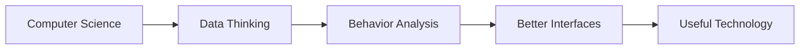

<div align="center">


<a href="https://git.io/typing-svg">
  
</a>

<br/>

Computer Science student interested in data, behavior, and systems thinking.

I explore the intersection of computer science, data, human behavior, and interface design.  
My goal is to build technology that is logically structured, practically useful, and easier for people to understand and use.

<br/>

[](https://www.tiktok.com/@bingenz_?lang=en)
[](https://bingenz.com/)
[](https://www.facebook.com/groups/1083123091540550?locale=vi_VN)
[](https://www.facebook.com/share/1AUUKX6NHa/)

<br/>


</div>

---

## About Me

```txt
[Profile Record]
name            = "Le Thuan"
location        = "Vietnam"
background      = "Computer Science Student"
specialty       = "Web systems and automation"
work_style      = ["careful", "persistent", "honest"]
focus_area      = "Data-informed and human-centered technology"
design_view     = "Clear structure, usable interfaces, thoughtful experience"
```

---

## System Summary

```txt
Foundation : Computer science, mathematics, data, human behavior
Approach   : Analysis, systems thinking, structured problem solving
Outcome    : Clear interfaces, useful products, better user experience
Principles : Practical value, logical structure, real user needs
Goal       : Build a strong foundation in computer science and systems thinking while creating practical technology with real user value
Known For  : Thinking carefully, working with honesty, and building with clear purpose
```

---

## Interests

- `Blockchain` — exploring decentralized systems, smart contracts, and trust mechanisms in digital infrastructure
- `Backend & API` — designing server-side systems, RESTful services, and scalable automation
- `Data reasoning` — using patterns and analysis to support practical thinking and product direction
- `Interface design` — building systems that are clear, usable, and purposeful
- `Human-computer interaction` — studying how people engage with interfaces and digital experiences
- `Behavior & decision-making` — understanding how users think, choose, and respond to digital systems

---

## Languages


---

## Study Map



---

## GitHub Stats

<div align="center">
  
</div>

<div align="center">
  
  
</div>

---

## What I'm Focused On

- Strengthening my foundation in computer science, data, and structured problem solving
- Studying how behavior and decision-making can inform better product design
- Improving interfaces through clarity, usability, and real user needs
- Building projects where analytical thinking and design thinking work together
- Focusing on useful systems rather than unnecessary complexity

---

## 🔗 Connect

<div align="center">

[](https://github.com/bingenz)
[](https://www.facebook.com/share/1AUUKX6NHa/)
[](https://www.tiktok.com/@bingenz_?lang=en)
[](https://bingenz.com/)

</div>

---

<div align="center">

> Learning deeply, building carefully, and improving with every iteration.

</div>


