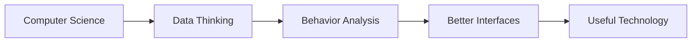

<div align="center">

[](https://bingenz.com/)

# Hi, I'm Bingenz

`Computer Science` `Behavior Analysis` `Systems Thinking`

Computer Science student interested in data, behavior, and systems thinking.

I explore the intersection of computer science, data, human behavior, and interface design.  
My goal is to build technology that is logically structured, practically useful, and easier for people to understand and use.

[](https://github.com/bingenz)
[](https://github.com/bingenz)
[](https://www.facebook.com/share/1AUUKX6NHa/)
[](https://www.tiktok.com/@bingenz_?lang=en)

</div>

## About Me

```txt
[Profile Record]
name            = "Le Thuan"
location        = "Vietnam"
background      = "Computer Science Student"
specialty       = "User behavior and audience analysis"
interests       = ["data", "mathematics", "ui/ux", "frontend systems"]
work_style      = ["careful", "persistent", "honest"]
focus_area      = "Data-informed and human-centered technology"
design_view     = "Clear structure, usable interfaces, thoughtful experience"
```

## System Summary

```txt
Input      : Computer science, mathematics, data, human behavior
Process    : Analysis, systems thinking, structured problem solving
Output     : Clear interfaces, useful products, better user experience
Constraint : Practical value, logical structure, real user needs
Goal       : Build a strong foundation in computer science, data, and systems thinking while creating practical technology with real user value
Known For  : Thinking carefully, working with honesty, and building with clear purpose
```

## Research Interests

- `Behavior modeling` - understanding how users think, choose, and respond to digital systems
- `Decision systems` - exploring how structure, logic, and data support better outcomes
- `Human-computer interaction` - studying how people engage with interfaces and digital experiences
- `Data reasoning` - using patterns and analysis to support practical thinking and product direction

## Study Map



## GitHub Stats

<div align="center">
  
  
</div>

## What I'm Focused On

- Strengthening my foundation in computer science, data, and structured problem solving
- Studying how behavior and decision-making can inform better product design
- Improving interfaces through clarity, usability, and real user needs
- Building projects where analytical thinking and design thinking work together
- Focusing on useful systems rather than unnecessary complexity

## Featured Work

I am currently developing my work around:

- `Data and analysis` - exploring patterns, reasoning, and structured decision-making
- `Human behavior` - understanding how people think, choose, and interact with systems
- `UI and UX systems` - designing interfaces that are clear, usable, and purposeful
- `Computer science foundations` - strengthening logic, systems thinking, and problem-solving

## Tech I Like Working With

```txt
Core Areas   : Computer science, mathematics, data analysis, behavioral reasoning
Technical    : Structured problem solving, systems thinking, logical modeling
Frontend     : Interface architecture, usability, user experience refinement
Interests    : Human-computer interaction, practical technology, applied design
```

## Connect

- GitHub: [github.com/bingenz](https://github.com/bingenz)
- Facebook: [facebook.com/share/1AUUKX6NHa](https://www.facebook.com/share/1AUUKX6NHa/)
- TikTok: [tiktok.com/@bingenz_](https://www.tiktok.com/@bingenz_?lang=en)

---

> Learning deeply, building carefully, and improving with every iteration.
